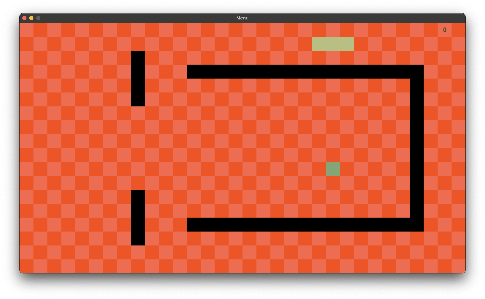

# snake
1. Это игра змейка, где надо играть за ящеров и сражаться с древними русами. <br/>
2. Скриншоты к игре:<br/>
 <br/>
 <br/>
 <br/>
 <br/>
4. серый квадратик - это фрукт(древний рус), красный - это бонус(жрец). В самой игре будут препядствия и жрец может спавниться на них -- это своего рода троллинг ящеров.<br/>
5. Запуск игры: сначала надо склонить репозиторий, затем перейти через терминал в ветку dev после клонирования репозитория, находясь в ветке dev необходимо прописать "python3 main.py".<br/>
```shell
git clone<...>
git checkout dev
python3 main.py
```
6. У игры есть пару ньюансов например передвижение сделано для WASD и на стрелочках или русской раскладке не работает.<br/>
p.s<br/>
В игре достаточно громкая музыка, так что рекомендуется сделать звук по тише.
